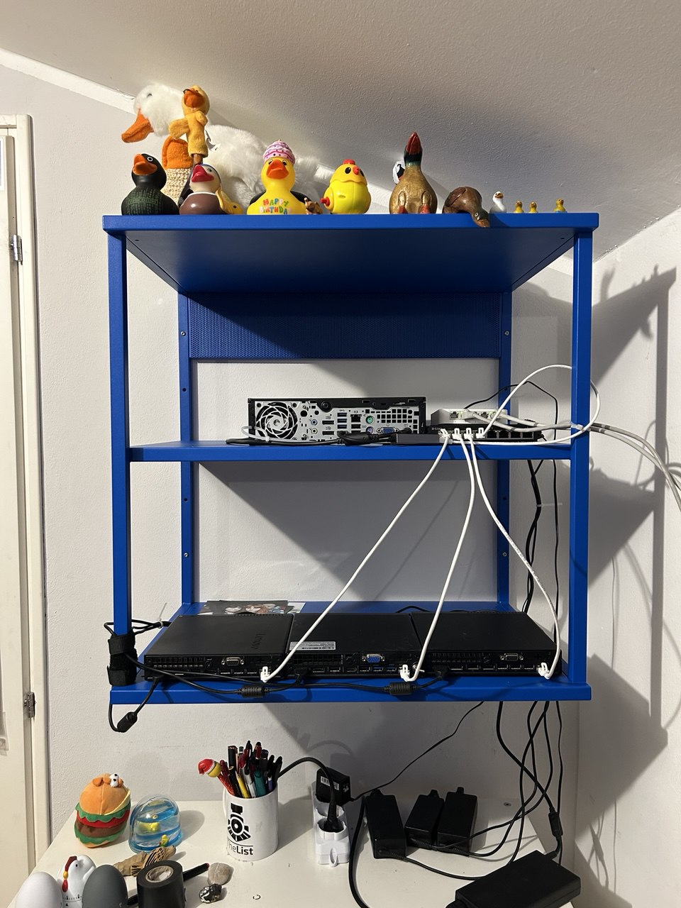

# homelab

configurations i use in my homelab

# background

my homelab is currently composed of four compute nodes and a managed switch (from right to left):

- tango: router (opnsense), hp compaq elite 8300 SFF
  
  - i5 3470 (4c/4t)
  - 8GB RAM
  - 240GB SSD

- aldo: proxmox node, [lenovo thinkcentre m910q tiny](https://www.refurbed.it/p/lenovo-thinkcentre-m910q-tiny/24397/?offer=612436)

  - i5 6500T (4c/8t)
  - 64GB RAM
  - 256GB m.2

- dbero: proxmox node, [lenovo thinkcentre m910q tiny](https://www.refurbed.it/p/lenovo-thinkcentre-m910q-tiny/24397/?offer=612436)

  - i5 6500T (4c/8t)
  - 64GB RAM
  - 256GB m.2
  - 500GB SSD

- navighero: proxmox node, [lenovo thinkcentre m920q tiny](https://www.refurbed.it/p/lenovo-thinkcentre-m920q-tiny/)
  - i5 8500t (6c/12t)
  - 16GB RAM
  - 256GB m.2

- switch: dlink dgs110 08v2

the cluster is running on a separate subnet thanks to *tango*, which has two nics:

- one on my "home" network (192.168.1.0/24)
- one on my "homelab" network (172.10.0.0/16)

# vms

- k8s-related vms run in a dedicated vlan (11.11.11.0/24)
- no other vms for now... maybe some plex stuff idk i'll see
  
# next up

- i want to make my vm/container images publicly available
- proxmox tutorials
- opensense tutorials
